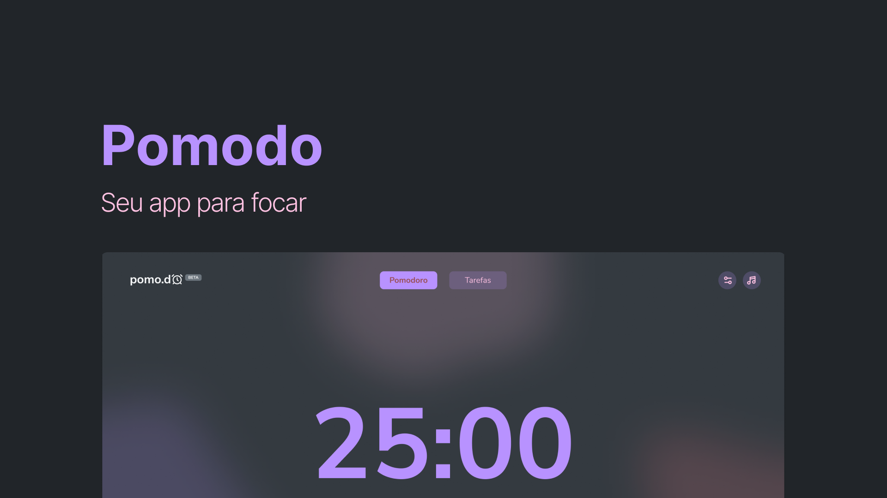

# **Pomodo - Seu app pra focar**

## **Introdução**

Esse é um projeto pessoal pra auxiliar no meu foco durante o dia de desenvolvimento. Ele foi projetado para atender um desejo meu de utilizar a técnica pomodoro ouvindo um Lo-Fi. Portanto, sempre que o timer pomodoro estiver ativo, uma música Lo-Fi estará tocando.

Esse projeto ainda esta em caráter MVP, ou seja, muitas funcionalidades ainda não foram implementadas por completo mas já é um aplicativo funcional e útil para quem quer focar em uma atividade sem se preocupar com o relógio.

## Roadmap 🗺

- [x] :white_check_mark: Timer pomodoro integrado com player de música
- [x] :white_check_mark: Player com controles de volume, mute e play/pause
- [] Gerenciador de tarefas integrado com timer pomodoro
- [] Tela de configurações gerais
- [] Músicas do Player customizável
- [] Tutorial guiado de utilização
- [] Notificações
- [] Politica de privacidade
- [] Incorporação de ADS

_OBS: O Rodmap listado não está em ordem de desenvolvimento._

## **Status do projeto**

| **EM ANDAMENTO**

## **Autor**

Guilherme Selair – [@GuiSelair](https://github.com/GuiSelair)
